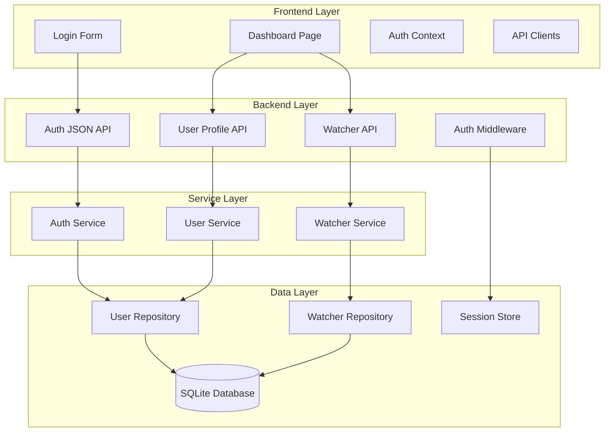

# Design Document

## Overview

This design implements a unified authentication system and comprehensive homepage dashboard for the YouTube Music/Spotify playlist linking application. The architecture bridges the current session-based backend authentication with modern JSON APIs, enabling seamless frontend-backend communication while maintaining backward compatibility.

The implementation follows a backend-first approach with atomic commits, where each backend API endpoint is fully implemented and tested before corresponding frontend integration. This ensures focused changes with clear boundaries and isolated responsibilities.

## Steering Document Alignment

### Technical Standards (tech.md)
- **Rust Backend**: Leverages existing Axum framework, SQLx database layer, and session management
- **SolidJS Frontend**: Builds on established component patterns and Tailwind CSS styling
- **API Design**: Follows RESTful principles with consistent JSON request/response patterns
- **Security**: Maintains Argon2 password hashing and secure session cookie approach

### Project Structure (structure.md)
- **Backend Organization**: New endpoints added to existing `api/` module structure
- **Frontend Organization**: New components follow established `pages/` and `components/` hierarchy
- **Database Integration**: Extends existing user models and repository patterns
- **Testing Strategy**: Unit tests for backend logic, integration tests for API endpoints

## Code Reuse Analysis

### Existing Components to Leverage

**Backend Infrastructure:**
- **AuthSession & User Models**: Extend existing authentication session handling (`users/models.rs:6-10`)
- **Database Layer**: Build on existing SQLx connection pooling and migration system
- **API Router Pattern**: Follow established routing structure in `api/router.rs`
- **Session Management**: Utilize existing tower-sessions with SQLite storage
- **Password Hashing**: Continue using Argon2 implementation in user creation flow

**Frontend Infrastructure:**
- **Theme System**: Leverage existing dark mode toggle and theme context (`contexts/ThemeContext.tsx`)
- **Component Patterns**: Build on existing Navbar and styled components approach
- **Routing System**: Extend current SolidJS router configuration
- **Tailwind Styling**: Use established utility classes and custom component styles

### Integration Points

**Database Schema Extensions:**
- **User Credentials Table**: Already exists for OAuth token storage (`users/models.rs:13-22`)
- **Watchers Table**: Existing watcher management system (`users/models.rs:25-38`)
- **Sync Operations**: Existing sync operation tracking (`users/models.rs:78-89`)

**API Endpoint Extensions:**
- **Protected Routes**: Build on existing auth middleware patterns (`api/protected.rs:267-273`)
- **Session Validation**: Extend existing `auth_required` helper function
- **Error Handling**: Follow established StatusCode and JSON response patterns

## Architecture

### Modular Design Principles

**Backend Module Structure:**
```
backend/src/
├── api/
│   ├── auth.rs              # Extended with JSON endpoints
│   ├── protected.rs         # Enhanced watcher management
│   ├── users.rs             # New user profile endpoints
│   └── router.rs            # Updated routing configuration
├── users/
│   ├── models.rs            # Extended DTOs for API responses
│   ├── repository.rs        # Enhanced user operations
│   └── service.rs           # New business logic layer
```

**Frontend Module Structure:**
```
frontend/src/
├── components/
│   ├── auth/                # Authentication-specific components
│   ├── dashboard/           # Dashboard-specific components
│   └── watchers/            # Watcher management components
├── pages/
│   ├── Login.tsx            # Enhanced login with JSON API
│   ├── Dashboard.tsx        # Complete dashboard implementation
│   └── Profile.tsx          # New user profile management
├── contexts/
│   ├── AuthContext.tsx      # New authentication state management
│   └── UserContext.tsx      # User profile and session data
├── services/
│   ├── authApi.ts           # Authentication API client
│   ├── userApi.ts           # User management API client
│   └── watcherApi.ts        # Watcher management API client
```

### System Architecture Flow



## Components and Interfaces

### Backend API Components

#### Authentication API Extension (`api/auth.rs`)
**Purpose:** Add JSON-based authentication endpoints alongside existing HTML form authentication
**Interfaces:**
```rust
// New JSON endpoints
POST /api/auth/login    -> LoginResponse
POST /api/auth/register -> RegisterResponse  
POST /api/auth/logout   -> LogoutResponse
GET  /api/auth/profile  -> UserProfileResponse
```
**Dependencies:** Existing AuthSession, Database, User models
**Reuses:** Current session management, password hashing, validation logic

#### User Profile API (`api/users.rs`) 
**Purpose:** Provide user profile management and information endpoints
**Interfaces:**
```rust
GET  /api/users/profile        -> UserProfileResponse
PUT  /api/users/profile        -> UserProfileResponse
GET  /api/users/connections    -> ServiceConnectionResponse
POST /api/users/connections    -> ServiceConnectionResponse
DELETE /api/users/connections/{service} -> StatusResponse
```
**Dependencies:** AuthSession middleware, UserRepository, UserCredential models
**Reuses:** Existing user authentication patterns, database connection handling

#### Enhanced Watcher API (`api/protected.rs`)
**Purpose:** Extend existing watcher endpoints with comprehensive dashboard data
**Interfaces:**
```rust
GET  /api/watchers             -> WatcherListResponse (enhanced)
GET  /api/watchers/{id}/status -> WatcherStatusResponse
GET  /api/watchers/{id}/history -> SyncHistoryResponse
POST /api/watchers/{id}/preview -> SyncPreviewResponse
```
**Dependencies:** Existing WatcherRepository, SyncOperation models
**Reuses:** Current watcher CRUD operations, sync operation tracking

### Service Layer Components

#### Authentication Service (`users/service.rs`)
**Purpose:** Centralize authentication business logic and session management
**Interfaces:**
```rust
impl AuthService {
    async fn authenticate_json(&self, credentials: Credentials) -> Result<LoginResponse>
    async fn create_user(&self, request: RegisterRequest) -> Result<User>
    async fn get_user_profile(&self, user_id: i64) -> Result<UserProfileResponse>
    async fn update_user_profile(&self, user_id: i64, updates: ProfileUpdateRequest) -> Result<UserProfileResponse>
}
```
**Dependencies:** UserRepository, session validation helpers
**Reuses:** Existing database operations, password validation, user creation patterns

#### Watcher Management Service
**Purpose:** Enhanced business logic for watcher operations and dashboard data aggregation
**Interfaces:**
```rust
impl WatcherService {
    async fn get_user_dashboard(&self, user_id: i64) -> Result<DashboardResponse>
    async fn get_watcher_status(&self, watcher_id: i64) -> Result<WatcherStatusResponse>
    async fn get_sync_history(&self, watcher_id: i64, limit: Option<i32>) -> Result<SyncHistoryResponse>
}
```
**Dependencies:** WatcherRepository, SyncOperation repository
**Reuses:** Existing watcher queries, sync operation tracking, user validation

### Frontend Components

#### Authentication Context (`contexts/AuthContext.tsx`)
**Purpose:** Manage authentication state and session persistence across the application
**Interfaces:**
```typescript
interface AuthContextType {
  user: User | null;
  login: (credentials: LoginCredentials) -> Promise<LoginResult>;
  logout: () -> Promise<void>;
  register: (userData: RegisterData) -> Promise<RegisterResult>;
  isAuthenticated: () -> boolean;
  isLoading: boolean;
}
```
**Dependencies:** authApi service, localStorage for session persistence
**Reuses:** Existing navigation patterns, error handling approaches

#### Dashboard Page (`pages/Dashboard.tsx`)
**Purpose:** Comprehensive dashboard displaying user profile, watchers, and recent activity
**Interfaces:**
```typescript
interface DashboardProps {
  // Main dashboard container
}
interface DashboardState {
  userProfile: UserProfile;
  watchers: WatcherSummary[];
  recentActivity: SyncOperation[];
  serviceConnections: ServiceConnection[];
}
```
**Dependencies:** userApi, watcherApi, AuthContext
**Reuses:** Existing styling patterns, loading states, error handling

#### Watcher Management Components (`components/watchers/`)
**Purpose:** Modular components for watcher display, creation, and management
**Components:**
- `WatcherCard.tsx` - Individual watcher display with status
- `WatcherForm.tsx` - Create/edit watcher configuration
- `SyncHistory.tsx` - Display sync operation history
- `SyncPreview.tsx` - Preview sync changes before execution

## Data Models

### API Response Models

#### LoginResponse
```rust
#[derive(Serialize, Deserialize)]
pub struct LoginResponse {
    pub success: bool,
    pub user: UserProfileResponse,
    pub message: String,
}
```

#### UserProfileResponse  
```rust
#[derive(Serialize, Deserialize)]
pub struct UserProfileResponse {
    pub id: i64,
    pub username: String,
    pub created_at: OffsetDateTime,
    pub last_login: Option<OffsetDateTime>,
}
```

#### DashboardResponse
```rust
#[derive(Serialize, Deserialize)]
pub struct DashboardResponse {
    pub profile: UserProfileResponse,
    pub watchers: Vec<WatcherSummary>,
    pub service_connections: Vec<ServiceConnectionStatus>,
    pub recent_activity: Vec<SyncOperationSummary>,
    pub statistics: DashboardStatistics,
}
```

#### WatcherSummary
```rust
#[derive(Serialize, Deserialize)]
pub struct WatcherSummary {
    pub id: i64,
    pub name: String,
    pub source_service: String,
    pub target_service: String,
    pub is_active: bool,
    pub last_sync_at: Option<OffsetDateTime>,
    pub last_sync_status: Option<String>,
    pub total_songs: Option<i32>,
    pub sync_success_rate: Option<f32>,
}
```

#### ServiceConnectionStatus
```rust
#[derive(Serialize, Deserialize)]
pub struct ServiceConnectionStatus {
    pub service: String,
    pub is_connected: bool,
    pub expires_at: Option<OffsetDateTime>,
    pub last_successful_auth: Option<OffsetDateTime>,
    pub requires_reauth: bool,
}
```

### Frontend TypeScript Models

#### User Profile
```typescript
interface UserProfile {
  id: number;
  username: string;
  createdAt: string;
  lastLogin?: string;
}
```

#### Dashboard Data
```typescript
interface DashboardData {
  profile: UserProfile;
  watchers: WatcherSummary[];
  serviceConnections: ServiceConnection[];
  recentActivity: SyncActivity[];
  statistics: DashboardStats;
}
```

## Error Handling

### Backend Error Patterns

#### Authentication Errors
- **Invalid Credentials**: Return 401 with structured error message
- **Session Expired**: Return 401 with session_expired flag
- **Account Locked**: Return 423 with lockout information
- **Validation Errors**: Return 400 with field-specific error details

#### API Error Response Format
```rust
#[derive(Serialize)]
pub struct ApiErrorResponse {
    pub error: String,
    pub error_code: Option<String>,
    pub field_errors: Option<HashMap<String, String>>,
    pub retry_after: Option<u64>,
}
```

### Frontend Error Handling

#### Error Display Patterns
- **Form Validation Errors**: Inline field errors with clear correction guidance
- **API Communication Errors**: Toast notifications with retry options
- **Authentication Errors**: Redirect to login with preserved destination
- **Network Connectivity**: Persistent banner with retry mechanism

#### Error Recovery Strategies
- **Automatic Retry**: Transient network errors with exponential backoff
- **Session Recovery**: Automatic re-authentication for expired sessions
- **Graceful Degradation**: Display cached data with refresh indicators when APIs are unavailable
- **User Guidance**: Clear instructions for resolving common error scenarios

## Testing Strategy

### Backend Testing

#### Unit Testing
- **Authentication Service**: Test login, registration, session management
- **User Service**: Test profile operations, validation logic
- **Watcher Service**: Test CRUD operations, business logic
- **Repository Layer**: Test database operations, query optimization

#### Integration Testing  
- **API Endpoints**: Test complete request/response cycles
- **Session Management**: Test session creation, validation, expiration
- **Database Transactions**: Test data consistency across operations
- **Error Scenarios**: Test error handling and edge cases

#### Test Structure Example
```rust
#[cfg(test)]
mod tests {
    use super::*;
    use tokio_test;

    #[tokio::test]
    async fn test_json_login_success() {
        // Test JSON login endpoint with valid credentials
    }

    #[tokio::test]  
    async fn test_json_login_invalid_credentials() {
        // Test JSON login with invalid credentials
    }
}
```

### Frontend Testing

#### Component Testing
- **Authentication Forms**: Test form submission, validation, error display
- **Dashboard Components**: Test data loading, display, user interactions
- **Context Providers**: Test state management, session persistence
- **API Integration**: Test service calls, error handling, loading states

#### Integration Testing
- **Authentication Flow**: Complete login/logout workflow testing
- **Dashboard Loading**: Test data fetching and display coordination
- **Error Scenarios**: Test error handling across component boundaries
- **Responsive Behavior**: Test mobile and desktop layout adaptations

## Implementation Phases

### Phase 1: Backend API Foundation (4 commits)
1. **Add JSON Authentication Endpoints** - Extend `auth.rs` with JSON login/register/logout
2. **Create User Profile API** - New `users.rs` with profile endpoints  
3. **Enhance Watcher API** - Add dashboard data endpoints to `protected.rs`
4. **Add Service Layer** - Create business logic services for auth and user management

### Phase 2: Frontend Authentication Integration (3 commits)
1. **Create Auth Context and API Client** - Authentication state management
2. **Update Login Page** - Integrate JSON API with existing login form
3. **Add Route Protection** - Session-based route guards and redirection

### Phase 3: Dashboard Implementation (4 commits)
1. **Create User API Client** - Frontend service for user profile operations
2. **Build Dashboard Data Loading** - API integration for dashboard data
3. **Implement Dashboard UI Components** - User profile, statistics, navigation
4. **Add Watcher Management UI** - Watcher cards, status display, basic operations

### Phase 4: Enhanced Watcher Features (3 commits)
1. **Add Watcher Creation/Editing** - Forms and validation for watcher management
2. **Implement Sync History Display** - Historical sync operation viewing
3. **Add Sync Preview Functionality** - Preview changes before execution

Each phase builds incrementally with backend implementation preceding frontend integration, ensuring focused commits with clear boundaries and testable functionality.