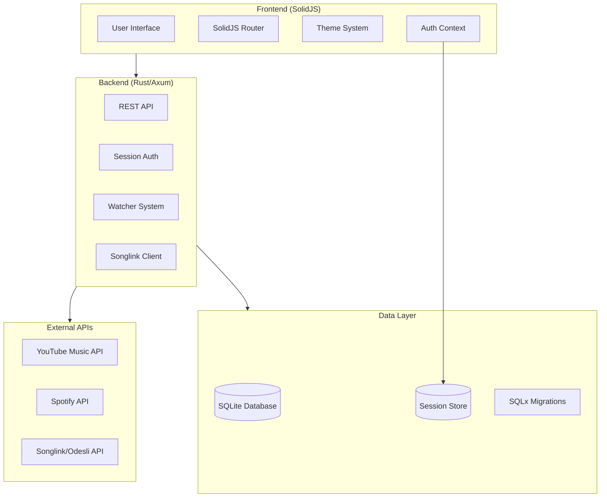

# Technical Steering

## Architecture Overview

### System Architecture


### Technology Stack Choices

#### Backend Technology Stack
- **Language**: Rust (latest stable)
  - **Rationale**: Type safety, performance, memory safety, excellent async support
  - **Version**: Latest stable (currently 1.80+)
  
- **Web Framework**: Axum 0.8+
  - **Rationale**: Modern async framework, excellent type safety, middleware ecosystem
  - **Key Features**: Tower middleware, extractors, routing, WebSocket support
  
- **Database**: SQLite with SQLx 0.8+
  - **Rationale**: Serverless, zero-config, excellent for single-instance deployments
  - **Features**: Full ACID compliance, SQLx compile-time query validation
  - **Migration Strategy**: SQLx migrate! macro for version control
  
- **Authentication**: axum-login 0.17+ with tower-sessions 0.14+
  - **Session Storage**: SQLite-based session store with 1-day expiry
  - **Password Hashing**: Argon2 (industry standard, secure)
  - **Session Management**: Secure, HTTP-only cookies

#### Frontend Technology Stack  
- **Framework**: SolidJS 1.8+ with TypeScript 5.3+
  - **Rationale**: Reactive, performant, small bundle size, excellent TypeScript support
  - **Build Tool**: Vite 5.1+ for fast development and optimized builds
  
- **Styling**: Tailwind CSS 3.4+ with PostCSS
  - **Rationale**: Utility-first, highly customizable, excellent dark mode support
  - **Configuration**: Custom theme extensions for brand colors
  
- **Routing**: @solidjs/router 0.8+
  - **Configuration**: File-based routing with protected routes
  - **Navigation**: Programmatic navigation with route guards

#### Integration Layer
- **HTTP Client**: reqwest 0.12+ (backend), fetch API (frontend)
- **Serialization**: serde + serde_json for all API communication
- **Error Handling**: thiserror 2.0+ for structured error types
- **Async Runtime**: tokio 1.44+ with full features
- **Testing**: tokio-test, httpmock for API mocking

### Development Standards

#### Code Quality Standards
- **Rust Code Style**: 
  - Follow `rustfmt` defaults with no custom configuration
  - Use `clippy::all` + `clippy::pedantic` lints
  - Maximum function length: 50 lines
  - Maximum file length: 500 lines
  - Use `#[must_use]` for important return values
  
- **TypeScript Code Style**:
  - ESLint with @typescript-eslint rules
  - Prettier for consistent formatting
  - Strict TypeScript configuration (`strict: true`)
  - No `any` types except for third-party library integration
  
- **Naming Conventions**:
  - Rust: `snake_case` for variables/functions, `PascalCase` for types
  - TypeScript: `camelCase` for variables/functions, `PascalCase` for types/components
  - Database: `snake_case` for tables and columns
  - API endpoints: kebab-case paths (`/api/user-credentials`)

#### Testing Requirements
- **Backend Testing**:
  - Unit tests for all business logic (target: >80% coverage)
  - Integration tests for API endpoints
  - Database tests with transaction rollback
  - End-to-end tests for critical user flows
  
- **Frontend Testing**:
  - Component unit tests with SolidJS Testing Library
  - Integration tests for user workflows
  - Visual regression testing for UI components
  
- **API Integration Testing**:
  - Mock external API responses with httpmock
  - Test error scenarios and rate limiting
  - Validate request/response schemas

#### Security Guidelines
- **Authentication Security**:
  - Session tokens: cryptographically secure random generation
  - Password hashing: Argon2id with appropriate parameters
  - Session expiry: 1 day inactivity, secure cookie flags
  - CSRF protection: SameSite=Strict cookies
  
- **API Security**:
  - Input validation on all endpoints
  - Rate limiting for public endpoints
  - SQL injection prevention via SQLx prepared statements
  - OAuth token encryption at rest
  
- **Data Privacy**:
  - No logging of sensitive data (passwords, tokens)
  - OAuth tokens encrypted in database
  - User data deletion compliance (GDPR-ready)

#### Performance Standards
- **Backend Performance**:
  - API response time: <200ms for most endpoints
  - Database queries: <50ms average
  - Memory usage: <100MB baseline per instance
  - Async operations: prefer `tokio::spawn` for CPU-intensive work
  
- **Frontend Performance**:
  - Initial page load: <3s on 3G networks
  - JavaScript bundle: <500KB gzipped
  - Time to Interactive: <5s
  - Core Web Vitals: all "Good" ratings
  
- **Database Performance**:
  - Connection pooling with appropriate limits
  - Query optimization with EXPLAIN QUERY PLAN
  - Indexing strategy for frequently queried columns
  - Regular VACUUM and ANALYZE operations

## Technology Choices

### Programming Languages and Versions
- **Backend**: Rust 1.80+ (latest stable)
- **Frontend**: TypeScript 5.3+ (strict mode)
- **Database Schema**: SQL (SQLite dialect)
- **Build Scripts**: Shell scripts for cross-platform compatibility

### Frameworks and Libraries

#### Core Backend Dependencies
```toml
[dependencies]
axum = "0.8.1"           # Web framework
axum-login = "0.17.0"    # Authentication
sqlx = "0.8.1"           # Database ORM
tokio = "1.44.0"         # Async runtime
serde = "1.0"            # Serialization
reqwest = "0.12.14"      # HTTP client
argon2 = "0.5.2"         # Password hashing
anyhow = "1.0"           # Error handling
```

#### Core Frontend Dependencies
```json
{
  "solid-js": "^1.8.15",
  "@solidjs/router": "^0.8.4",
  "tailwindcss": "^3.4.1",
  "typescript": "^5.3.3",
  "vite": "^5.1.0"
}
```

### Development Tools
- **Rust Toolchain**: rustup with stable toolchain
- **Node.js**: 18+ LTS for frontend development
- **Package Management**: Cargo (Rust), npm (Node.js)
- **Version Control**: Git with conventional commits
- **IDE Support**: rust-analyzer, TypeScript language server

### Deployment Infrastructure
- **Development**: Local SQLite database, embedded server
- **Production Considerations**: 
  - Single-instance deployment model
  - SQLite with WAL mode for better concurrency
  - Reverse proxy (nginx) for static asset serving
  - TLS termination at proxy level

## Patterns & Best Practices

### Recommended Code Patterns

#### Backend Patterns
- **Repository Pattern**: Database access through repository traits
```rust
#[async_trait]
pub trait UserRepository {
    async fn find_by_id(&self, id: i64) -> Result<Option<User>>;
    async fn create(&self, user: CreateUser) -> Result<User>;
}
```

- **Service Layer Pattern**: Business logic separated from API handlers
```rust
pub struct UserService {
    repository: Box<dyn UserRepository>,
}

impl UserService {
    pub async fn create_user(&self, data: CreateUserRequest) -> Result<User> {
        // Business logic here
    }
}
```

- **Error Handling Pattern**: Structured errors with context
```rust
#[derive(thiserror::Error, Debug)]
pub enum AppError {
    #[error("Database error: {0}")]
    Database(#[from] sqlx::Error),
    
    #[error("Validation error: {message}")]
    Validation { message: String },
}
```

#### Frontend Patterns
- **Component Composition**: Small, focused components
```tsx
export function PlaylistCard(props: PlaylistCardProps) {
  return (
    <div class="playlist-card">
      <PlaylistImage src={props.image} />
      <PlaylistMeta title={props.title} count={props.count} />
    </div>
  );
}
```

- **Context Pattern**: Global state management
```tsx
const [user, setUser] = createSignal<User | null>(null);
const UserContext = createContext({ user, setUser });
```

### Error Handling Approaches

#### Backend Error Handling
- **Structured Errors**: Use `thiserror` for domain-specific errors
- **Error Propagation**: Use `?` operator for clean error bubbling  
- **User-Friendly Messages**: Convert technical errors to user messages
- **Logging Strategy**: Log errors with context, not sensitive data

#### Frontend Error Handling
- **Error Boundaries**: Catch and display component errors gracefully
- **Toast Notifications**: Non-blocking error notifications
- **Retry Mechanisms**: Automatic retry for transient failures
- **Fallback UI**: Graceful degradation when features fail

### Logging and Monitoring

#### Backend Logging
```rust
tracing_subscriber::registry()
    .with(EnvFilter::new("debug,sqlx=warn"))
    .with(tracing_subscriber::fmt::layer())
    .init();
```
- **Log Levels**: ERROR for failures, WARN for issues, INFO for lifecycle, DEBUG for troubleshooting
- **Structured Logging**: Use `tracing` crate with structured fields
- **Performance Logging**: Track slow queries and API responses

#### Frontend Monitoring
- **Error Tracking**: Console errors and unhandled promise rejections
- **Performance Metrics**: Core Web Vitals measurement
- **User Analytics**: Privacy-focused usage analytics
- **Feature Flags**: Progressive feature rollout capability

### Documentation Standards

#### Code Documentation
- **Rust**: Doc comments for all public APIs using `///`
- **TypeScript**: JSDoc comments for complex functions and types
- **Database**: Schema comments for table and column purposes
- **API**: OpenAPI/Swagger specification for all endpoints

#### Architecture Documentation
- **ADR Pattern**: Architectural Decision Records for major choices
- **Diagrams**: Mermaid diagrams for system architecture
- **Runbooks**: Operational procedures for common tasks
- **Migration Guides**: Version upgrade procedures

## Integration Architecture

### External API Integration Patterns
- **OAuth 2.0 Flow**: Standard authorization code flow with PKCE
- **Rate Limiting**: Exponential backoff with jitter
- **Circuit Breaker**: Fail-fast for degraded external services
- **Caching Strategy**: Cache API responses with appropriate TTL

### Database Design Principles
- **Normalization**: 3NF with denormalization for performance
- **Indexing Strategy**: Index foreign keys and frequently queried columns
- **Migration Strategy**: Forward-only migrations with rollback procedures
- **Data Integrity**: Foreign key constraints and check constraints

### API Design Standards
- **RESTful Design**: Resource-oriented URLs with appropriate HTTP methods
- **Consistent Response Format**: Standardized success/error response structure
- **Version Strategy**: URL versioning (`/api/v1/`) for breaking changes
- **Content Negotiation**: JSON primary, with extensibility for other formats